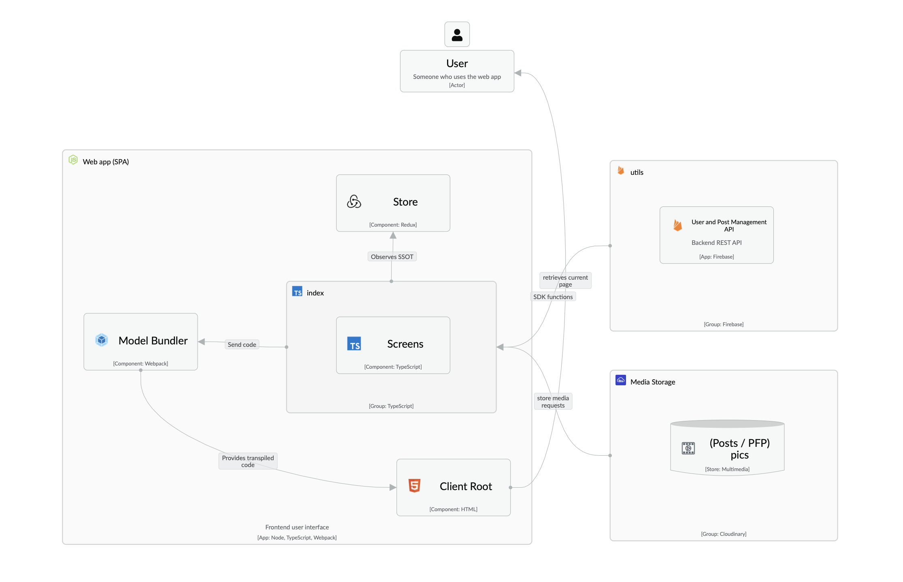

# Social Network

This project is an interactive and collaborative web application that allows users to register, log in and access a main dashboard where they can visualize and share data with other users. Developed with a focus on accessible and responsive design, the application ensures that all users have an inclusive user experience adapted to mobile and desktop devices.

## Main Functionalities 🪄

- User Authentication: Users can register with their email and password, and must be authenticated to access all application functions.
- Shared Dashboard: Once logged in, the user has access to a dashboard where relevant data shared by other users of the application can be viewed.
- Content Publishing: Authenticated users can upload and share new data, which encourages interaction and information flow among users.
- Profile Management: Users can view and modify their profile, allowing them to customize their information and keep it up to date.
- User Interaction: The application ensures that users can interact through shared data, enhancing the collaborative experience.
- Pixel Perfect Design: All project deliverables comply with the Pixel Perfect design concept with respect to the initial designs, ensuring visual fidelity.
- Focus on Accessibility: Web accessibility techniques have been applied to ensure that all elements are usable by people with disabilities.
- Responsive Design: The application is designed to adapt to a variety of devices, from mobile to desktop monitors.

## Tech Stack ⚙️
- Node JS
- Typescript 
- Webpack
- Firebase SDK
- Cloudinary

## Visual design
I opted for a minimalist design, inspired in the style of the social network threads, keeping a light visual feeling to the user, but without leaving behind functionalities such as being able to attach photos to the posts. The design is fully responsive to any device.

## C4 Model
## Context Diagram

## User Flow

## App Diagram

## Container Diagram
